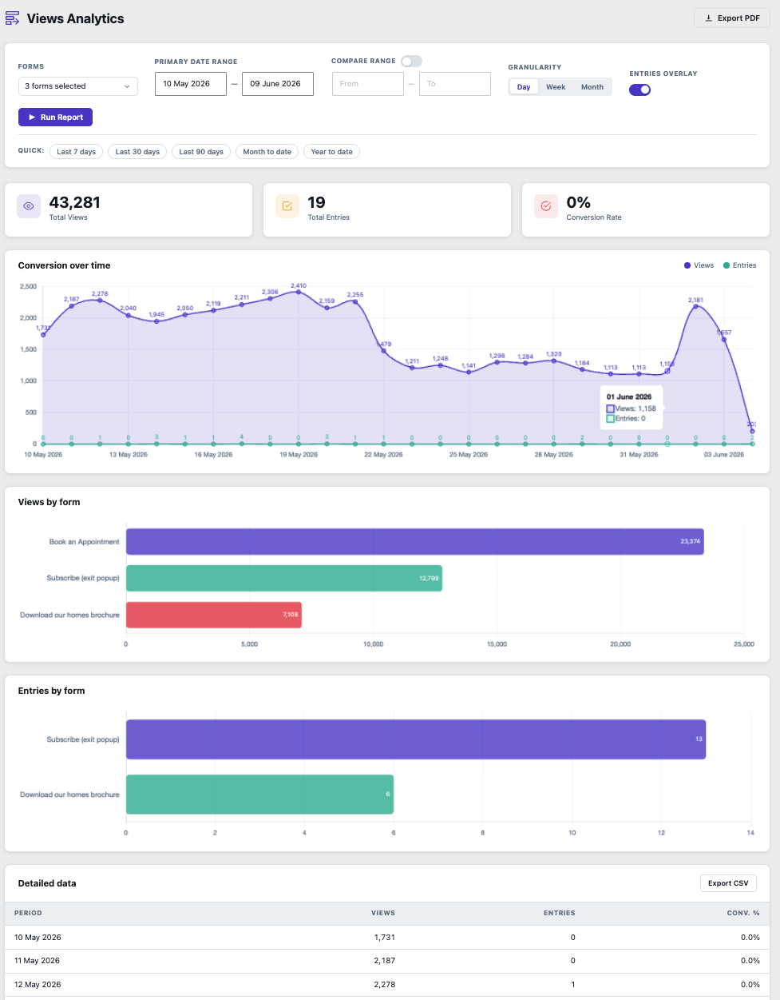

# GF Views Analytics

A WordPress plugin that provides an analytics dashboard for Gravity Forms views and entries.

## Description

GF Views Analytics adds a reporting page under **Tools > Views Analytics** that lets you visualise and analyse Gravity Forms view and entry data over time. Filter by form and date range, compare periods side by side, overlay entries against views, and export reports as PDF or CSV. The dashboard is also accessible via **Forms > Views Analytics** in the Gravity Forms admin menu and via the admin bar.

## Requirements

- WordPress 5.8+
- PHP 8.0+
- Gravity Forms (any current version)

## Installation

1. Upload the `gf-views-analytics` folder to `/wp-content/plugins/`
2. Activate the plugin through **Plugins > Installed Plugins**
3. Navigate to **Tools > Views Analytics**, **Forms > Views Analytics**, or use the admin bar shortcut

### Filters

- **Forms** — multi-select dropdown with search; choose one, many, or all forms
- **Date range** — primary date range with a date picker
- **Quick presets** — Last 7 days, Last 30 days, Last 90 days, Month to date, Year to date
- **Granularity** — group data by Day, Week, or Month; automatically switches to hourly when a single day is selected
- **Entries overlay** — toggle entries data on or off
- **Compare range** — enable a second date range to compare periods side by side
- **Chart view** — control how the main chart area is displayed (see below)

### Dashboard

- **Stat cards** — Total Views, Total Entries, Conversion Rate; each card shows a delta badge when a comparison period is active
- **Comparison breakdown cards** — when a compare range is active, a row of cards appears above the main chart showing Total Views and Total Entries for each date range individually, colour-coded to match the chart series (purple/red for views, teal/amber for entries)
- **Line charts** — views and entries over time; display is controlled by the Chart view toggle
- **Views by form bar chart** — total views broken down per form (shown when multiple forms are in the result set); switches to a grouped bar chart when a compare range is active, with primary and compare bars side by side
- **Entries by form bar chart** — total entries broken down per form (shown when multiple forms are in the result set and entries overlay is on); also grouped when a compare range is active
- **Data table** — full period-by-period breakdown including deltas and conversion rate

### Chart View

The **Chart view** segmented control in the filters row changes how the line chart area is rendered without re-running the report:

- **All** — three charts stacked: Views only, Entries only, and Combined (views and entries together)
- **Combined** — views and entries on a single chart (the classic default)
- **Views** — views line only; useful when entry counts are so much smaller they become unreadable alongside views
- **Entries** — entries line only

The selected chart view is saved to the URL so bookmarked or shared reports restore the same layout.

### Exports

- **PDF** — opens the browser print dialog with a print stylesheet optimised for A4 portrait; includes a report header with period, forms, and generated timestamp
- **CSV** — downloads directly in the browser with all visible columns including deltas

### URL State

All filters — including form selection, date ranges, granularity, compare range, entries overlay, and chart view — are written to the URL when you run a report. Switching the chart view also updates the URL immediately without re-running. Reports can be bookmarked, shared, or refreshed and will restore exactly.

### Date Format

The date format used throughout the dashboard and exports can be set per user via **Screen Options** (top right of the page). Available options are:

- DD/MM/YYYY
- MM/DD/YYYY
- YYYY-MM-DD
- DD Mon YYYY
- DD Month YYYY
- WordPress default (inherits the format set under Settings > General)

Each user's preference is saved independently so it does not affect other users.

### PDF White Label

The PDF report header can be customised per user via **Screen Options**. Options include:

- **Report title** — replaces the default "GF Views Analytics Report" heading
- **Logo** — replaces the plugin icon and page heading; accepts a URL or choose from the media library. Recommended height: 40px.

White label settings are saved per user and take effect immediately when running a new report.

## Changelog

### 1.1.1
- Added **Chart view** toggle (All / Combined / Views / Entries) — switch between chart layouts instantly without re-running the report; selection is persisted to the URL
- **All** mode stacks three charts: Views only, Entries only, and Combined
- Updated **Views by form** and **Entries by form** bar charts to show grouped comparison bars when a compare range is active — primary and compare periods appear side by side per form, colour-coded to match the chart series (purple/red for views, teal/amber for entries); chart height scales automatically with the number of forms
- Added form selection to URL state so selected forms are preserved on page load and when switching chart view
- Fixed comparison breakdown cards being cut off in PDF/print — switched to a 2-column print grid with full date wrapping
- Fixed stat cards not filling page width in PDF/print — corrected print grid to 3 columns
- Fixed GitHub updater ignoring release tags with an uppercase `V` prefix

### 1.1.0
- Added comparison breakdown cards — when a compare range is active, a row of stat cards appears above the main chart showing Total Views and Total Entries for each date range individually, with the date range displayed on each card and colours matching the corresponding chart series

### 1.0.8
- Fixed **Graph Values** graph values dropped off

### 1.0.7
- Fixed **Views over time** graph colours match the legend and renamed to Conversion over time

### 1.0.6
- Added **Views Analytics** link to the Gravity Forms admin menu under **Forms > Views Analytics**
- Added **Views Analytics** shortcut to the WordPress admin bar under the Gravity Forms node
- Fixed PDF export charts being cut off — charts now resize to fit the full A4 page width before the print dialog opens, and all chart canvases are constrained within their containers in the print stylesheet
- Added data labels to all charts: values appear above each point on the line chart (suppressed when the dataset has more than 60 points to avoid crowding) and right-aligned inside each bar on the Views by form and Entries by form bar charts

### 1.0.5
- Fix **Bug Fix** Minor bug fixes and readme updates

### 1.0.4
- Added Entries by form bar chart alongside the existing Views by form chart
- Fixed missing `by_form` data assignment that prevented both breakdown charts from rendering

### 1.0.3
- Fixed date format display in chart and table — tokens now replaced in a single pass to prevent partial replacements corrupting month names
- Added date format preference via Screen Options, saved per user via AJAX
- Date pickers now reflect the chosen display format via Flatpickr's alt input
- Dates in print header now use the chosen display format

### 1.0.2
- Removed unique visitors stat (always returned 1 due to aggregated view rows)
- Fixed table column alignment — period column left-aligned, all data columns right-aligned
- Added hourly granularity, triggered automatically when a single day is selected
- Added timezone offset via `CONVERT_TZ` so period grouping reflects site local time

### 1.0.1
- Fixed view counts — queries now use `SUM(count)` instead of `COUNT(*)` to read the actual view totals stored in `wp_gf_form_view`
- Fixed timezone handling — date range boundaries now convert from site local time to UTC before querying

### 1.0.0
- Initial release

## Data Source

Views are read from the `wp_gf_form_view` table that Gravity Forms maintains natively, summing the `count` column for accurate view totals. Entries are read from `wp_gf_entry` where `status = 'active'`. All database queries are timezone-aware and offset against the site timezone configured under Settings > General, so date boundaries reflect local time rather than UTC.